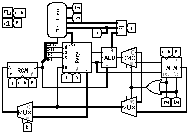

# Processador 16-bits Galvamoto16x (GM16x)
## Sobre

Um projeto desenvolvido para a cadeira de Arquitetura de Computadores na UFCA, através do qual o professor nos instruiu a montar um processador similar ao MIPS.

Sendo assim, montamos o Galvamoto16.
Ele recebe instruções em hexadecimal diretamente na sua memória ROM. Com a implementação futura do assembler, será possível escrever um código em texto e traduzi-lo para hexadecimal.
## Componentes
### Main

O principal circuito no qual estão localizadas todas as ligações entre os subcomponentes do nosso processador.
Alguns sinais de controle também estão definidos aqui.

### ROM

Composto pelo registrador PC, que armazena a linha em que a ROM está lendo.
A memória ROM contém as instruções que são lidas e enviadas para o processador.
A cada pulso do clock, o endereço no registrador é incrementado e passado novamente como endereço para a ROM, lendo assim linha por linha. No entanto, dependendo da situação, podem ocorrer saltos de linhas.

### Lógica de controle: `Ctrl Logic`

O controle recebe os 4 bits da instrução (12-15) e define quais operações ele irá realizar. As possibilidades são:

- j - jump
- b - branch
- ldMem - carregar da memória
- strMem - carregar na memória
- strReg - escrever no registrador

É possível visualizar quais os sinais que cada instrução passa através da tabela de instruções.

### Unidade Lógica Aritmética (ULA): `ALU`

A ULA recebe como entrada o OP e os conteúdos dos registradores e o imediato, e realiza operações como soma, subtração e shift left.
Ela é capaz de realizar todas as operações possíveis. No entanto, por meio de um multiplexador, é possível escolher apenas a operação desejada a ser executada com as entradas.

### Memória RAM: `MEM`

A memória RAM 16x16 é alterada por meio das operações de lw e sw. Ela possui um endereço da linha atual e, como é possível escrever nela, recebe um DataIn como entrada e o DataOut como saída.
Assim, é possível realizar leitura e escrita na memória RAM, mas é mais lento do que armazenar nos registradores. No entanto, oferece mais espaço.

### Banco de registradores: `Regs`

Os 16 registradores do processador estão localizados aqui. O registrador $0 é apenas leitura, sempre retornando o valor 0, e o $11 é reservado para operações de branch. Portanto, sempre que a operação de branch for verdadeira, ele saltará para o endereço contido no registrador $11.

### Instruções

Este é o formato atual das instruções do GM16x.

| i    | hex  | op   | j   | b   | lw  | sw  | str |
| ---- | ---- | ---- | --- | --- | --- | --- | --- |
| none | 0000 | 0000 | 0   | 0   | 0   | 0   | 0   |
| li   | 1dii | 0001 | 0   | 0   | 0   | 0   | 1   |
| add  | 2dst | 0010 | 0   | 0   | 0   | 0   | 1   |
| addi | 3dsi | 0011 | 0   | 0   | 0   | 0   | 1   |
| or   | 4dst | 0100 | 0   | 0   | 0   | 0   | 1   |
| sl   | 5dst | 0101 | 0   | 0   | 0   | 0   | 1   |
| sli  | 6dst | 0110 | 0   | 0   | 0   | 0   | 1   |
| slt  | 7dst | 0111 | 0   | 0   | 0   | 0   | 1   |
| beq  | 8xst | 1000 | 1   | 1   | 0   | 0   | 0   |
| bne  | 9xst | 1001 | 1   | 1   | 0   | 0   | 0   |
| j    | Aiii | 1010 | 1   | 0   | 0   | 0   | 0   |
| lw   | Bdsi | 1011 | 0   | 0   | 1   | 0   | 1   |
| sw   | Cist | 1100 | 0   | 0   | 0   | 1   | 0   |